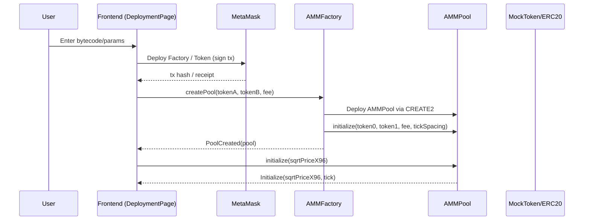
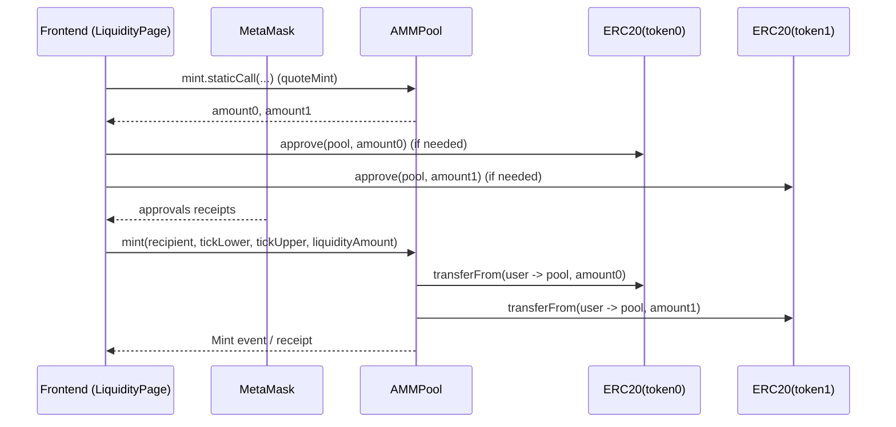
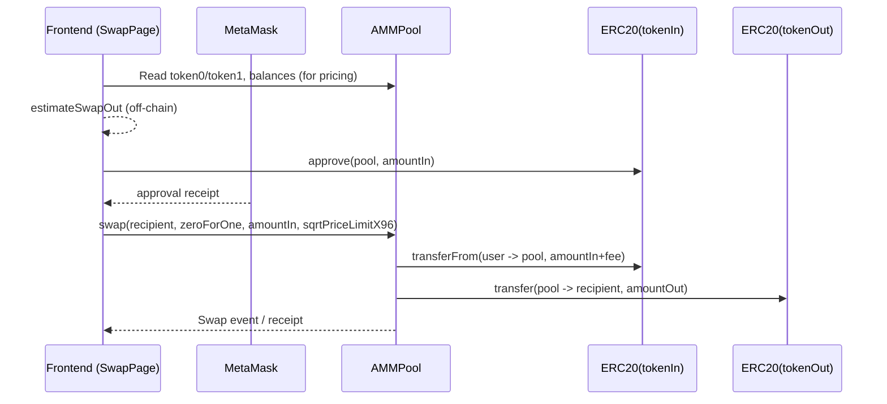
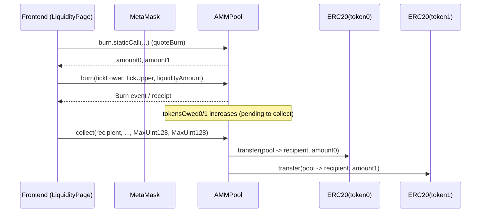

# Architecture Document 

---

## 1. System Overview

This project implements a teaching/prototype AMM (Automated Market Maker) protocol:

- **On-chain (Solidity / Foundry)**
  - `AMMFactory` creates and registers pools and manages fee tiers.
  - `AMMPool` provides core capabilities such as price initialization, adding/removing liquidity (`mint`/`burn`/`collect`), and swapping (`swap`).
  - Math libraries `TickMath` / `LiquidityMath` support tick and liquidity-related computations.
  - `MockToken` is a test ERC20 token used to validate the end-to-end flow locally or on a testnet.

- **Frontend (React + ethers v6)**
  - Page-based workflows: Swap, Liquidity, Deployment (deploy/create pool/initialize), Advanced (owner management & routing experiments), Analytics, MockToken (mint/burn test tokens).
  - `src/api/*.js` acts as the “contract interaction layer (SDK)”, encapsulating provider/signer setup and ABI calls.
  - `src/api/pools.js` persists the pool list and selected pool via `localStorage`.
  - `src/api/routing.js` provides a routing prototype: multi-hop path discovery + per-hop quoting + sequential execution.

### 1.1 Relationship to Uniswap V3 (Implementation Boundaries)

The interfaces and data structures borrow key concepts from Uniswap V3 (tick, `sqrtPriceX96`, concentrated-liquidity positions), but the implementation is a **simplified version**:

- `AMMPool.swap` performs an exact-input swap using a **constant-product approximation based on pool balances**, and updates price after the swap via balance ratio; it does not implement V3’s stepwise price movement and cross-tick SwapMath.
- Fields like `feeGrowthGlobal*` and `Position.feeGrowthInside*` exist, but the contract logic does not yet implement a complete “fee growth accounting and distribution” loop.
- `observe` (TWAP oracle) is not implemented on-chain; the frontend analytics module falls back to approximations (e.g., using the current tick/price).

This document describes the **current implementation** and also highlights extension points for evolving toward a more complete V3-style design.

---

## 2. Code Structure & Module Boundaries

### 2.1 Smart Contracts (Foundry)

Directory: `contracts/`

- `src/AMMFactory.sol`: factory / registry / fee tier management
- `src/AMMPool.sol`: core single-pool logic (price, positions, `mint`/`burn`/`swap`/`collect`)
- `src/MockToken.sol`: test ERC20 (Ownable mint)
- `src/interfaces/IAMMFactory.sol`, `src/interfaces/IAMMPool.sol`: core interfaces and events
- `src/libraries/TickMath.sol`, `src/libraries/LiquidityMath.sol`: tick & liquidity math
- `script/*.s.sol`: deployment and interaction scripts (Deploy / DeployTokens / Interact)
- `test/*.t.sol`: unit/integration tests (Foundry)

### 2.2 Frontend (Vite + React)

Directory: `frontend/`

- `src/main.jsx`: entry
- `src/App.jsx`: routing and wallet connection entry (MetaMask)
- `src/pages/*`: feature pages (Swap/Liquidity/Deployment/Advanced/Analytics/MockToken)
- `src/components/*`: shared UI (NavBar, Charts, PoolSelector)
- `src/api/amm.js`: contract interaction SDK (ethers v6)
- `src/api/pools.js`: pool list persistence and state sync (`localStorage`)
- `src/api/routing.js`: multi-hop routing prototype (route generation, quoting, sequential execution)
- `src/api/tokens.js`: testnet token address book
- `src/api/abi/*`: contract ABI JSON

---

## 3. System Context & Data Flow

### 3.1 System Context

- **User**: accesses the frontend via a browser
- **Wallet**: MetaMask injects `window.ethereum` and provides accounts, signatures, and transaction submission
- **Chain**: Sepolia or local Anvil (the frontend enforces Sepolia `chainId` in `ensureSepolia`)
- **Contracts**: Factory / Pool / ERC20 tokens
- **Local storage**: browser `localStorage` stores the pool list and the most recently selected pool

### 3.2 Typical Data Flows

- Reads: the frontend uses `provider.call()` or contract view methods to fetch state (`slot0/liquidity/token0/token1/getPool/...`).
- Writes: the frontend uses a `signer` to send transactions (`createPool/initialize/mint/swap/burn/collect/approve/mintToken...`).
- Events: the analytics module fetches historical Swap events via `queryFilter(Swap)` and aggregates them using block timestamps.

---

## 4. On-Chain Architecture (Smart Contract Design)

### 4.1 `AMMFactory` (Pool Factory & Registry)

**Responsibilities**

- Stores `owner`; only the owner can enable new fee tiers via `enableFeeAmount`.
- Maintains `feeAmountTickSpacing[fee] -> tickSpacing`; enabled by default:
  - `500 -> 10`
  - `3000 -> 60`
  - `10000 -> 200`
- Maintains a bidirectional mapping `getPool[tokenA][tokenB][fee] -> poolAddress`.
- Creates pools via `createPool(tokenA, tokenB, fee)`:
  - Sorts tokens automatically: `token0 < token1`
  - Uses `CREATE2` with salt `keccak256(abi.encode(token0, token1, fee))` (deterministic address)
  - After deployment, calls `AMMPool(pool).initialize(token0, token1, fee, tickSpacing)` to perform basic parameter initialization

**Key Events**

- `PoolCreated(token0, token1, fee, tickSpacing, pool)`
- `FeeAmountEnabled(fee, tickSpacing)`

### 4.2 `AMMPool` (Single Pair Pool)

**Responsibilities**

- Stores pool metadata: `token0/token1/fee/tickSpacing/maxLiquidityPerTick`
- Stores current price and tick: `slot0_ (sqrtPriceX96, tick, ...)`
- Manages concentrated-liquidity positions: `positions[key]`
- Tracks tick initialization data: `ticks[tick] -> TickInfo`
- Exposes core methods:
  - `initialize(token0, token1, fee, tickSpacing)`: called by the factory at creation time; only once
  - `initialize(sqrtPriceX96)`: sets the initial price; only once
  - `mint(...)`: adds liquidity and transfers `token0`/`token1` from the user
  - `burn(...)`: removes liquidity and accrues claimable `token0`/`token1` into `tokensOwed*`
  - `collect(...)`: transfers `tokensOwed*` to a recipient
  - `swap(...)`: exact-input swap; charges a fee on input and computes output using the balance-based formula

**Concurrency / Reentrancy Protection**

- Uses `_locked` plus the `lock` modifier to enforce mutual exclusion on `mint`/`burn`/`swap`/`collect`, preventing reentrancy and mid-state exploits.

**Position Key Convention**

- On-chain key: `keccak256(abi.encodePacked(owner, tickLower, tickUpper))`
- The frontend `getPosition` computes the same key via `ethers.solidityPackedKeccak256(['address','int24','int24'], ...)`.

**Fee Model (Current Implementation)**

- `swap` charges input fees as `fee / 1_000_000`; fees remain in the pool’s balances.
- Position “fee growth distribution” fields are not yet fully wired end-to-end (future extension).

### 4.3 Math Libraries

- `TickMath`
  - `getSqrtRatioAtTick(tick)`: tick -> `sqrtPriceX96`
  - `getTickAtSqrtRatio(sqrtPriceX96)`: `sqrtPriceX96` -> tick
  - Constants: `MIN_TICK/MAX_TICK` and `MIN_SQRT_RATIO/MAX_SQRT_RATIO`

- `LiquidityMath`
  - `addDelta(uint128, int128)`: safe add/sub
  - `getAmount0ForLiquidity / getAmount1ForLiquidity`: compute required token amounts given a price range and liquidity
  - `getLiquidityForAmounts`: estimate liquidity from provided `token0`/`token1` amounts
  - Embedded `FullMath.mulDiv`: high-precision mul/div to avoid overflow

### 4.4 `MockToken`

- Built on OpenZeppelin `ERC20` + `Ownable`
- Mints an initial supply to the deployer in the constructor (respecting decimals)
- `mint(to, amount)` is owner-only (the frontend `MockTokenPage` checks `owner()`)

---

## 5. Key Component Interactions (Sequences / Workflows)

The diagrams below focus on interactions among the frontend, wallet, and contracts.

### 5.1 Deploy & Create a Pool

Notes:

- Pool creation in the factory is atomic: deployment and basic initialization happen within the same transaction.
- **Price initialization** (`AMMPool.initialize(sqrtPriceX96)`) is a separate transaction and should typically be done before the first `mint`/`swap`.

### 5.2 Add Liquidity (Mint)

Notes:

- The frontend uses `staticCall` to estimate required token amounts and reduce failed transactions.
- `mint` updates `positions` and `ticks`, and may update global `liquidity` (when the current price is inside the tick range).

### 5.3 Swap (Exact Input)

Notes:

- The frontend estimates off-chain first and then prompts for confirmation.
- The current contract does not expose a `minAmountOut` parameter; the frontend mainly relies on `sqrtPriceLimitX96` as a price boundary (protection is limited in this simplified model).

### 5.4 Remove Liquidity & Withdraw (Burn + Collect)

---

## 6. Frontend Architecture (UI Layers & Interaction Layer)

### 6.1 App Entry & Routing

- `src/main.jsx`: mounts React
- `src/App.jsx`:
  - `connectWallet()`: uses `ethers.BrowserProvider(window.ethereum)` to get signer and address
  - `react-router-dom`: routes to 6 pages
  - top `NavBar`: shared navigation and connect button

### 6.2 Contract Interaction Layer: `src/api/amm.js`

This file acts as the project’s “frontend SDK”. Responsibilities include:

- Network validation: `ensureSepolia(provider)`
- Safe reads: `safeCallView(provider, address, abi, fn, args)` to avoid misinterpreting empty `0x` responses
- Contract instances: `getFactory/getPoolContract/getErc20Contract`
- Pool lifecycle: `getPool/createPool/simulateCreatePool/initializePool`
- Liquidity: `quoteMint/addLiquidity/quoteBurn/removeLiquidity/collectFees/getPosition/getTickInfo`
- Trading: `estimateSwapOut/swapExactIn`
- Analytics: `getSwapHistory/get24hVolume/calculateTVL/calculatePrice/...` (part on-chain event aggregation + simplified algorithms)

> Note: when oracle/analytics-related contract functions are missing, the frontend falls back (e.g., if `getPoolPriceObservations` cannot find `observe()`, it approximates using the current tick).

### 6.3 Pool Management: `src/api/pools.js`

- `localStorage` keys:
  - `amm_pool_list`: pool list
  - `amm_selected_pool`: most recently selected pool
- Supports: add/update/delete pools, refresh pool `slot0` state, and format display names.

### 6.4 Routing Prototype: `src/api/routing.js`

- `MultiHopRouter`:
  - `generatePossibleRoutes()`: generates 1-hop routes, 2-hop via WETH, and 2-hop via stablecoins
  - `getRouteQuote()`: per-hop quoting by calling `estimateSwapOut`
  - `executeMultiHopSwap()`:
    - 1-hop: directly calls `swapExactIn`
    - multi-hop: currently “executes swaps sequentially” (no unified Router contract)

### 6.5 Page/Component Interaction Matrix (`src/pages/*`)

This matrix maps “page UI behaviors” to “frontend API calls” and “on-chain contract methods”, useful for architecture presentations.

| Page | Primary responsibilities (user view) | Frontend APIs used (`src/api/*`) | On-chain interactions (core contracts) |
|---|---|---|---|
| `SwapPage.jsx` | Select tokens/fee, find/create pool, quote, submit swap | `ensureSepolia`, `getPool`, `estimateSwapOut`, `swapExactIn`, (optional) `createPool/simulateCreatePool` | `AMMFactory.getPool/createPool`, `ERC20.approve`, `AMMPool.swap`, read `token0/token1/slot0` |
| `LiquidityPage.jsx` | Select pool, quote mint, add liquidity, quote burn, remove + collect, query positions | `quoteMint`, `addLiquidity`, `quoteBurn`, `removeLiquidity`, `collectFees`, `getPosition`, `getPoolContract` | `AMMPool.mint/burn/collect`, `ERC20.approve`, read `token0/token1/positions` |
| `DeploymentPage.jsx` | Deploy factory/token, create pool, initialize pool price | `deployFactory`, `deployToken`, `getPool`, `simulateCreatePool`, `createPool`, `initializePool`, `calculateSqrtPriceX96` + `pools.js` (persistence) | `ContractFactory.deploy`, `AMMFactory.createPool/getPool`, `AMMPool.initialize(sqrtPriceX96)` |
| `AdvancedTradePage.jsx` | Owner management (enable fee tiers), routing experiments/route quoting, liquidity & slot0 queries | `enableFeeAmount`, `getFactoryOwner`, `getFeeAmountTickSpacing`, `readSlot0`, `getPoolLiquidity`, `estimateSwapOut` + `routing.js` (`MultiHopRouter`) | `AMMFactory.enableFeeAmount/owner/feeAmountTickSpacing/getPool`, read `AMMPool.slot0/liquidity` |
| `AnalyticsPage.jsx` | Query pool state, fetch swap history, estimate TVL/volume/price impact, render charts | `readSlot0`, `getPoolLiquidity`, `getTickInfo`, `getSwapHistory`, `get24hVolume`, `calculateTVL`, `calculatePrice`, `calculatePriceImpact`, `getLiquidityDistribution`, `getPoolPriceObservations` (fallback) | `queryFilter(Swap)` + read `slot0/liquidity/ticks`, plus ERC20 `balanceOf` for TVL |
| `MockTokenPage.jsx` | Query balances/info, mint/burn test tokens (owner-only) | `getTokenBalance`, `getTokenInfo`, `mintToken`, `burnToken`, `ensureSepolia` | `ERC20.balanceOf/name/symbol/decimals/totalSupply`, (MockToken) `owner/mint/burn` |

Additional notes:

- `PoolSelector.jsx` and `src/api/pools.js` persist the pool list to `localStorage` and provide shared UI for selecting/refreshing pool state.
- `SwapPage.jsx` currently contains temporary local mocks (`getPoolList/addPoolToList/updatePoolInList`) alongside the real implementation in `src/api/pools.js`. This does not affect the architecture understanding but is technical debt to unify later.

---

## 7. Data Model (On-Chain / Off-Chain State)

### 7.1 Core On-Chain State

- `slot0_`: current `sqrtPriceX96` and `tick`
- `liquidity`: current active liquidity (in this simplified model, mainly updated in `mint`/`burn`)
- `positions[key]`: user liquidity per tick range and claimable amounts (`tokensOwed0/1`)
- `ticks[tick]`: whether a tick is initialized, gross/net liquidity, etc.

### 7.2 Off-Chain (Frontend) State

- `localStorage` pool list structure (see the frontend deployment/usage docs for the JSON schema)
- Page-level state:
  - Swap: token selection, fee, quote results, slippage, confirmation modal
  - Liquidity: tickLower/Upper, liquidityAmount, mint/burn quotes, position queries
  - Deployment: bytecode, deployed addresses, pool creation and price initialization

