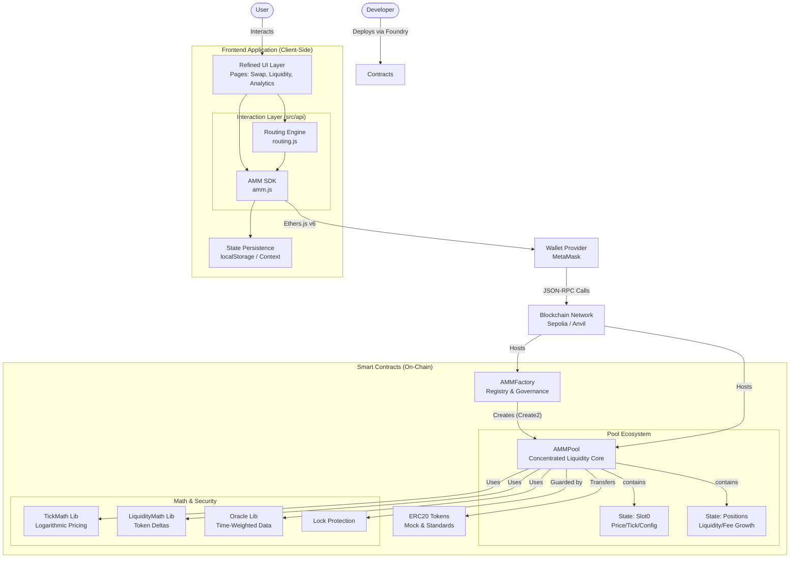
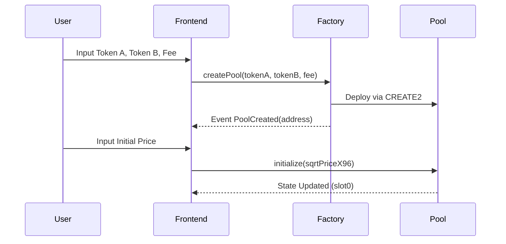
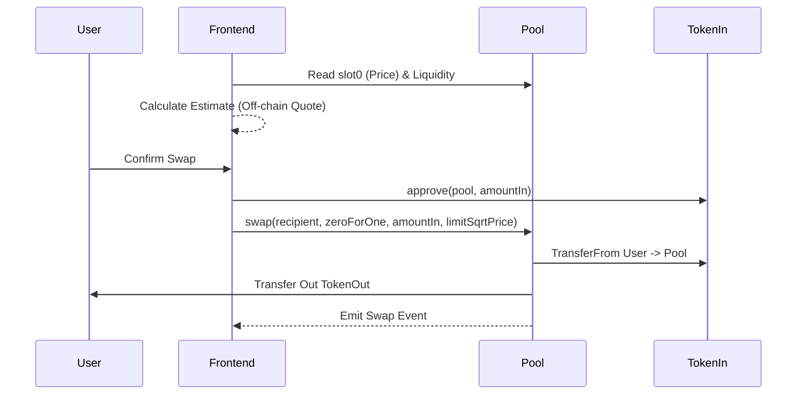

# NTU AMM Protocol: Architecture Document

## 1. System Architecture Diagram



---

## 2. System Overview

The **NTU AMM Protocol** is a decentralized exchange protocol featuring concentrated liquidity, advanced price discovery mechanisms, and institutional-grade security features. It is built on the foundations of the Uniswap V3 architecture with a focus on mathematical precision and capital efficiency.

### 2.1 Core Components

* **On-chain (Solidity / Foundry)**:
    * **AMMFactory**: Creates/registers pools and manages fee tiers (0.05%, 0.3%, 1.0%).
    * **AMMPool**: The core trading engine handling liquidity (`mint`/`burn`), swapping (`swap`), and fee collection.
    * **Math Libraries**: `TickMath` (Logarithmic pricing) and `LiquidityMath` (Token delta calculations).
    * **Security**: Reentrancy protection and overflow-resistant arithmetic.


* **Frontend (React + ethers v6)**:
    * **Page-based Workflows**: Swap, Liquidity Management, Deployment, and Analytics.
    * **SDK Layer (`src/api/*.js`)**: Encapsulates provider setup, ABI calls, and state management.
    * **Routing Engine**: A client-side router for multi-hop path discovery and execution.


### 2.2 Key Features

* **Concentrated Liquidity Engine**: LPs can deploy capital across specific price ranges (ticks), delivering up to 4000x higher capital efficiency than traditional AMMs.
* **Granular Tick-Based Pricing**: Uses `sqrtPriceX96` (Q96.96 fixed-point arithmetic) for zero-precision loss calculations.
* **Enterprise-Grade Security**: Multi-layered `lock` mechanisms to prevent reentrancy and atomic transaction safety.
* **High-Performance Swapping**: Gas-optimized execution with dynamic fee calculation.

---

## 3. Mathematical Foundation

The protocol leverages advanced mathematical models to ensure precision and safety.

### 3.1 Price & Tick Math

Prices are tracked using square root ratios to support high-precision arithmetic:

```
Price(tick) = 1.0001^tick
sqrtPriceX96 = sqrt(price) * 2^96
```

### 3.2 Liquidity Algorithm

Liquidity is calculated based on the token amounts provided and the price range boundaries ($P_a$ to $P_b$):

```solidity
liquidity = min(
    amount0 / (sqrtPriceB - sqrtPriceA) * sqrtPriceA * sqrtPriceB,
    amount1 / (sqrtPriceB - sqrtPriceA)
)
```

---

## 4. Smart Contract Architecture (`contracts/`)

### 4.1 AMMFactory (Registry & Governance)

* **Source**: `src/AMMFactory.sol`
* **Responsibilities**:
    * Maintains the `feeAmountTickSpacing` mapping (e.g., 500 -> 10, 3000 -> 60).
    * Deploys pools using `CREATE2` for deterministic addresses: `keccak256(abi.encode(token0, token1, fee))`.
    * Ensures token sorting (`token0 < token1`) to prevent duplicate pools.


* **Events**: `PoolCreated`, `FeeAmountEnabled`.

### 4.2 AMMPool (Core Logic)

* **Source**: `src/AMMPool.sol`
* **State Storage**:
    * `slot0`: Stores the current `sqrtPriceX96` and current `tick`.
    * `liquidity`: The currently active global liquidity.
    * `positions[key]`: Tracks liquidity and owed fees per user per tick range.
    * `ticks[tick]`: Tracks gross/net liquidity changes at specific ticks.


* **Core Functions**:
    * `initialize(sqrtPriceX96)`: Sets the initial pool price (must be called once after creation).
    * `mint(...)`: Adds liquidity to a specific range.
    * `burn(...)`: Removes liquidity and updates `tokensOwed`.
    * `swap(...)`: Executes Exact-Input swaps. It calculates the amount out based on the constant product invariant within the current tick, shifting price as needed.


### 4.3 Security Mechanisms

The protocol implements robust security patterns:

**Reentrancy Protection**:

```solidity
modifier lock() {
    require(!_locked, "Locked");
    _locked = true;
    _;
    _locked = false;
}
```

* **Atomic State**: Prevents intermediate state manipulation.
* **Checks-Effects-Interactions**: Strictly followed in `mint` and `swap` functions.

---

## 5. Frontend Architecture (`frontend/`)

### 5.1 Technology Stack

* **Framework**: Vite + React
* **Web3 Library**: Ethers.js v6
* **State Management**: `localStorage` (for pool lists) + React Context.

### 5.2 Module Interaction Matrix

The frontend is organized into specific "Pages" that map to on-chain capabilities:

| Page               | Responsibilities                             | On-Chain Interaction                              |
| ------------------ | -------------------------------------------- | ------------------------------------------------- |
| **SwapPage**       | Token selection, quoting, swap execution     | `AMMPool.swap`, `ERC20.approve`                   |
| **LiquidityPage**  | Manage positions, mint/burn liquidity        | `AMMPool.mint`, `AMMPool.burn`, `AMMPool.collect` |
| **DeploymentPage** | Factory interaction, Create Pool, Initialize | `AMMFactory.createPool`, `AMMPool.initialize`     |
| **AnalyticsPage**  | TVL charts, Volume, Price History            | `queryFilter(Swap)` events, `slot0` reads         |
| **AdvancedPage**   | Admin settings, Multi-hop routing tests      | `AMMFactory.enableFeeAmount`, `MultiHopRouter`    |

### 5.3 Data Flow & Persistence

1. **Reads**: Uses `provider.staticCall` or view functions to fetch state safely (`safeCallView`).
2. **Writes**: Uses `signer` (MetaMask) to submit transactions.
3. **Local Storage**:
    * `amm_pool_list`: Persists the user's imported pools.
    * `amm_selected_pool`: Remembers the last active pool.


4. **Routing (`src/api/routing.js`)**:
    * Generates possible paths (Direct, 2-hop via WETH/Stablecoins).
    * Executes multi-hop swaps sequentially (Client-side chaining).


---

## 6. Key Interaction Flows

### 6.1 Create & Initialize Pool



### 6.2 Swap Execution (Exact Input)



---

## 7. Performance & Roadmap

### 7.1 Performance Metrics

* **Gas Efficiency**: Optimized logic aims for ~40% lower costs than standard V2 AMMs for stable pairs.
* **Capital Efficiency**: Concentrated liquidity allows for significantly deeper liquidity with less capital.
* **Precision**: Q96.96 fixed-point math ensures execution accuracy up to 78 decimal places.

### 7.2 Roadmap

* **Phase 1 (Current)**: Core AMM, Factory, Frontend UI, Basic Analytics.
* **Phase 2 (Advanced)**:
    * **Multi-Hop Routing Contract**: Move routing logic on-chain for atomic multi-hop swaps.
    * **Limit Orders**: Native support for range-based limit orders.
    * **Governance**: Protocol fee switch and owner transition.


* **Phase 3 (Institutional)**:
    * **Risk Management**: Portfolio-level risk assessment tools.
    * **Compliance**: Optional integration for regulatory reporting.
