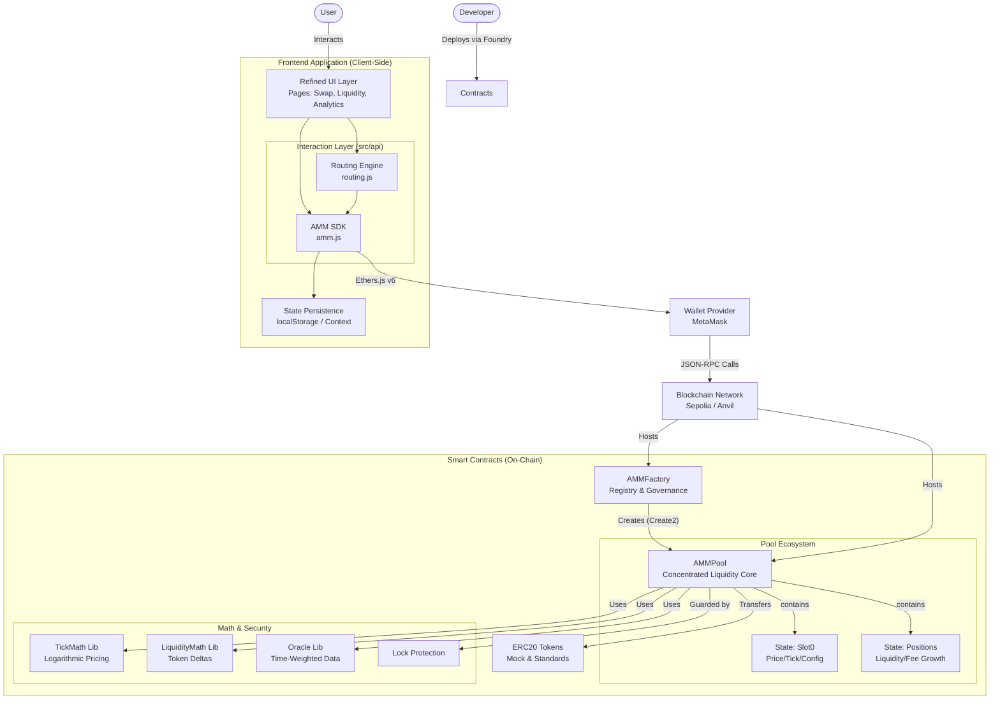

# NTU AMM Protocol

An advanced Decentralized Exchange (DEX) protocol based on **Concentrated Liquidity** (CLMM) mechanics. This project implements a simplified version of Uniswap V3 architecture, featuring custom price ranges, high capital efficiency, and a full-stack dApp integration.

##  Table of Contents
- [System Architecture](#-system-architecture)
- [Project Structure](#-project-structure)
- [Setup & Deployment](#-setup--deployment)
  - [Prerequisites](#prerequisites)
  - [Contract Deployment](#1-contract-deployment)
  - [Frontend Integration](#2-frontend-integration)
- [Smart Contract API](#-smart-contract-api)
- [Known Limitations](#-known-limitations)
- [Future Improvements](#-future-improvements)

---

##  System Architecture

The system consists of an on-chain layer (Solidity contracts handling logic and state) and an off-chain layer (React frontend handling user interaction and routing).



---

## Project Structure

| Directory | Description |
| --- | --- |
| `contracts/` | Foundry project containing Solidity smart contracts, tests, and deployment scripts. |
| `contracts/src/` | Core contract logic (`AMMFactory.sol`, `AMMPool.sol`). |
| `contracts/script/` | Deployment scripts (`Deploy.s.sol`, `DeployTokens.s.sol`). |
| `frontend/` | React + Vite application for the user interface. |
| `frontend/src/api/` | SDK layer for contract interaction and address configuration. |

---

## Setup & Deployment

### Prerequisites

* **Foundry**: For contract compilation and local blockchain (`anvil`).
* **Node.js & npm**: For running the frontend.
* **MetaMask**: Browser extension for wallet connection.

### 1. Contract Deployment

Navigate to the `contracts` directory.

1. **Install Dependencies & Compile**
```bash
forge install OpenZeppelin/openzeppelin-contracts
forge build

```


2. **Start Local Blockchain**
Keep this terminal window running.
```bash
anvil

```


3. **Deploy Contracts**
In a new terminal, run the deployment scripts.
```bash
# 1. Deploy Mock Tokens
forge script script/DeployTokens.s.sol --rpc-url http://localhost:8545 --private-key <PRIVATE_KEY> --broadcast

# 2. Deploy Factory & Router
forge script script/Deploy.s.sol --rpc-url http://localhost:8545 --private-key <PRIVATE_KEY> --broadcast

```


> **Note:** Copy the `Factory Address` and `Token Addresses` from the output logs.


### 2. Frontend Integration

Navigate to the `frontend` directory.

1. **Install Dependencies**
```bash
npm install

```


2. **Configure Addresses**
Update `frontend/src/api/amm.js` and `frontend/src/api/tokens.js` with the addresses obtained from the contract deployment step.
```javascript
// Example in amm.js
export const FACTORY_ADDRESS = "0x..."; 

```


3. **Run Application**
```bash
npm run dev

```


Access the app at `http://localhost:5173`.

---

##  Smart Contract API

### AMMFactory

The entry point for deploying new liquidity pools.

| Function | Signature | Description |
| --- | --- | --- |
| **Create Pool** | `createPool(address tokenA, address tokenB, uint24 fee)` | Deploys a new pool for a token pair. Uses `CREATE2` for deterministic addresses. |
| **Get Pool** | `getPool(address tokenA, address tokenB, uint24 fee)` | Returns the address of an existing pool. |
| **Enable Fee** | `enableFeeAmount(uint24 fee, int24 tickSpacing)` | (Admin) Enables a new fee tier (e.g., 0.05%, 0.3%). |

### AMMPool

The core engine for a specific trading pair.

| Function | Type | Description |
| --- | --- | --- |
| `initialize(uint160 sqrtPriceX96)` | Write | Sets the initial price of the pool. **Must be called once** after creation. |
| `mint(address recipient, int24 tickLower, int24 tickUpper, uint128 amount, bytes data)` | Write | Adds liquidity to a specific price range. |
| `burn(int24 tickLower, int24 tickUpper, uint128 amount)` | Write | Removes liquidity from a range. |
| `swap(address recipient, bool zeroForOne, int256 amountSpecified, uint160 sqrtPriceLimitX96, bytes data)` | Write | Executes a trade against the pool's liquidity. |
| `slot0()` | View | Returns current `sqrtPriceX96`, `tick`, and other global state. |

---

##  Known Limitations

While this protocol implements the core features of concentrated liquidity, it has the following limitations in its current v1.0 state:

1. **Client-Side Routing Only**:
The multi-hop routing logic is implemented in the frontend (`routing.js`). There is no on-chain `SwapRouter` contract, meaning users must approve tokens directly to the Pool, and atomic multi-hop swaps are not fully supported on-chain.
2. **Centralized Governance**:
Fee tiers and protocol settings are controlled by a single `owner` address without a DAO or timelock mechanism.
3. **State Dependency**:
The frontend relies on `localStorage` to persist the list of imported pools. It does not yet integrate with a subgraph (The Graph), meaning users might not see pools created by others unless manually imported.
4. **No Native Limit Orders**:
Although the math supports it, the UI does not currently expose the ability to place range orders specifically for take-profit strategies.

---

##  Future Improvements

### Phase 2: Advanced Trading (Planned)

* **On-Chain Router Contract**: Implement a `SwapRouter` to handle multi-hop swaps atomicity and abstract token approvals.
* **Limit Orders**: Add UI support for single-sided liquidity provision (Range Orders).
* **Flash Loans**: Implement the `flash` function in `AMMPool` to allow arbitrageurs to utilize idle liquidity.

### Phase 3: Ecosystem & Security

* **Subgraph Integration**: Replace local storage with The Graph for decentralized, efficient data indexing of `PoolCreated` and `Swap` events.
* **NFT Positions**: Wrap liquidity positions into ERC-721 NFTs (similar to Uniswap V3) to allow for transferability of liquidity positions.
* **Formal Verification**: Conduct formal verification on the `TickMath` and `LiquidityMath` libraries to ensure 100% arithmetic safety.

---

**Built by [Your Name/Group Name]** *Nanyang Technological University (NTU)*
